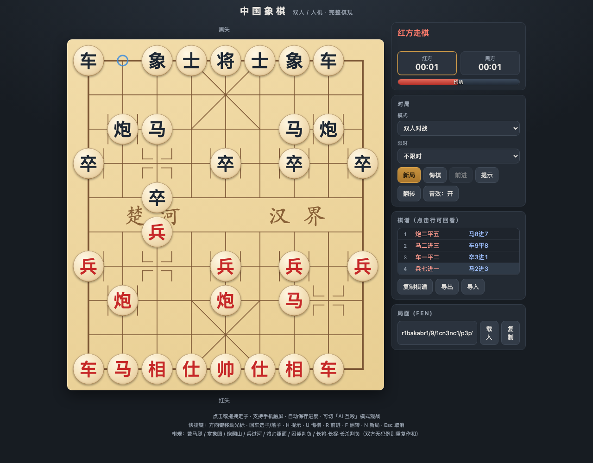
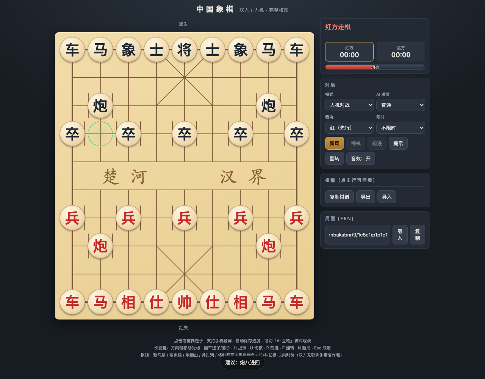
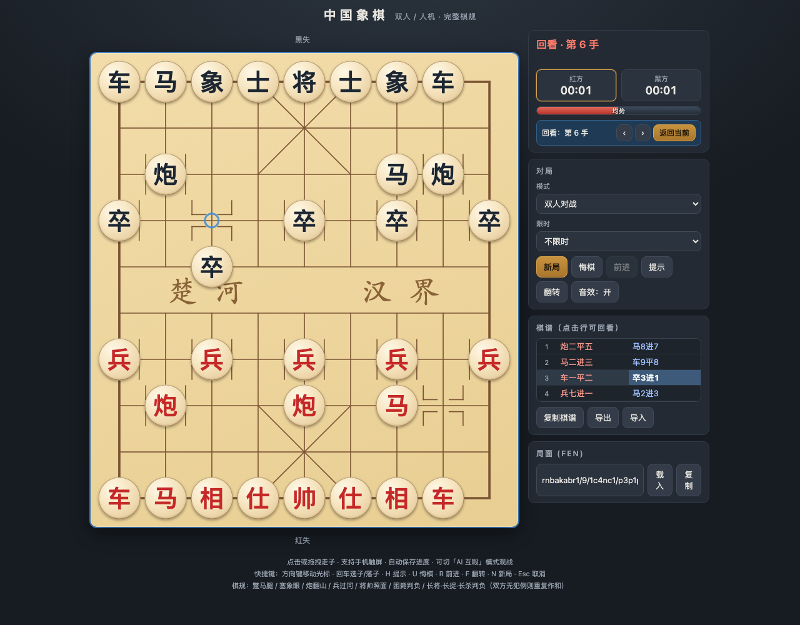
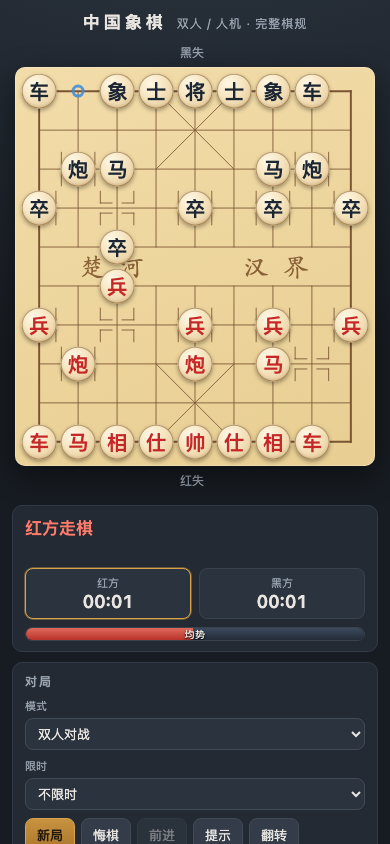

<div align="center">

# 中国象棋

**单文件网页中国象棋 —— 无依赖、无构建，双击即玩**

完整棋规（蹩马腿 / 将帅照面 / 困毙判负 / 长打裁决）· 内置 AI 引擎 · 中文棋谱 · 移动端适配

[](https://pzy2000.github.io/chinese-chess/)
[](#-特性)
[](#-特性)
[](#-特性)
[](#-特性)
[](#-测试)
[](#-测试)
[](#-测试)
[](LICENSE)

[English](README.md) | **简体中文**

</div>

## 截图预览

| | |
|:-:|:-:|
|  |  |
| *桌面端对局：中文棋谱、双方计时、实时评估条，点击或拖拽走子* | *AI 提示：按 `H` 让引擎推荐着法，绿圈虚线标出起点与落点* |
|  |  |
| *棋谱回看：点击任意一手回到该局面，`‹ ›` 翻手、一键返回当前* | *移动端自适应：布局随视口自动缩放，支持触屏点选与拖拽* |

## ✨ 特性

- **零依赖单文件**：全部样式、规则引擎、AI、音效内联于一个 `index.html`（约 71KB），`file://` 直接打开即玩
- **完整棋规**：蹩马腿、塞象眼、炮翻山、兵过河不后退、将帅照面、困毙判负，以及长将 / 长捉 / 长杀的**长打裁决**
- **内置 AI**：迭代加深 + Alpha-Beta 剪枝 + 静态搜索 + 将军延伸，三档难度；支持 AI 互殴观战模式
- **辅助功能**：着法提示、局面评估条、悔棋 / 前进、棋盘翻转、被吃子统计
- **中文棋谱**：标准纵线记谱（如「炮二平五」），点击棋谱任意行即可**回看**历史局面
- **导入导出**：中文记谱文本复制、紧凑串（`XQ1|FEN|moves`）导入导出、FEN 载入，进度自动存档
- **多端适配**：桌面 / 移动端布局自适应，触屏点选与拖拽并存，音效由 Web Audio 实时合成

## 🚀 快速开始

**在线试玩**：<https://pzy2000.github.io/chinese-chess/> —— 或本地运行，无需安装、无需构建：

```bash
# 方式一：直接用浏览器打开 index.html（双击即可）

# 方式二：起个本地静态服务
python3 -m http.server 8000
# 访问 http://localhost:8000
```

## 🎮 玩法

### 模式

| 模式 | 说明 |
|---|---|
| 人机对战 | 三档 AI 难度，可选执红（先行）或执黑 |
| 双人对战 | 同屏轮流走子 |
| AI 互殴 | 双 AI 对弈观战，可调出招节奏与双方棋力 |

### 快捷键

| 按键 | 功能 | 按键 | 功能 |
|---|---|---|---|
| `↑ ↓ ← →` | 移动光标 | `Enter` | 选子 / 落子 |
| `Esc` | 取消选中 | `H` | 提示着法 |
| `U` | 悔棋 | `R` | 前进 |
| `F` | 翻转棋盘 | `N` | 新局 |

## ⚖️ 棋规实现

- 走子约束：蹩马腿、塞象眼、炮翻山、仕相九宫与过河限制、兵过河横移不后退
- **将帅照面**等同被将军；**困毙判负**（非和棋）
- **长打裁决**：每手分类为「将 / 杀 / 捉 / 闲」——单方长将判负；单方长打、对方非长打判负；双方均长打或均无犯例则三次重复作和。`捉` 要求净得子，等价交换算「兑」

## 🧠 AI 引擎

纯函数引擎（不碰 DOM），主线程时间预算 + 迭代加深：

- Negamax + Alpha-Beta 剪枝，MVV-LVA 着法排序，被将军延伸
- 叶子节点静态搜索（只吃子）消除水平线效应
- 评估函数 = 子力 + 位置分（过河兵、沉底炮、马位等加权）
- AI 自动规避会因长打被判负的着法；低难度按概率「失误」制造难度差异

## 🧪 测试

引擎段被 `/*<ENGINE>*/` 标记包裹、不引用 DOM，可被 Node 直接抽取单测：

```bash
npm i                  # 安装 playwright-core（唯一 devDependency，仅测试用）
npm test               # 引擎单测 + 浏览器集成，共 56 项
npm run test:engine    # 只跑引擎（纯 Node，无需浏览器）
npm run test:browser   # 只跑浏览器集成（需本机有 Chrome / Edge）
```

走法生成以 **perft** 为权威校验：`44 / 1 920 / 79 666 / 3 290 240`（深度 1–4），改引擎后必跑 `npm run test:engine`。

## 📁 项目结构

```
.
├── index.html               # 游戏本体：样式 + 引擎 + UI 全部内联
├── tests/
│   ├── engine.mjs           # 抽取引擎段为临时 ESM 供 import
│   ├── engine.test.mjs      # 引擎单测：perft / 棋规 / FEN / 棋谱 / 长打 / 搜索
│   ├── browser.mjs          # 浏览器测试脚手架（自动找本机浏览器）
│   └── browser.test.mjs     # 浏览器集成：走子 / AI / 悔棋 / 回看 / 导入导出 …
└── docs/screenshots/        # README 配图
```

## 🤝 贡献

欢迎 Issue 与 PR。提交前请确保 `npm test` 全绿（perft 是走法生成的硬性校验）。

## 📄 License

[MIT](LICENSE) © 2026 pzy
